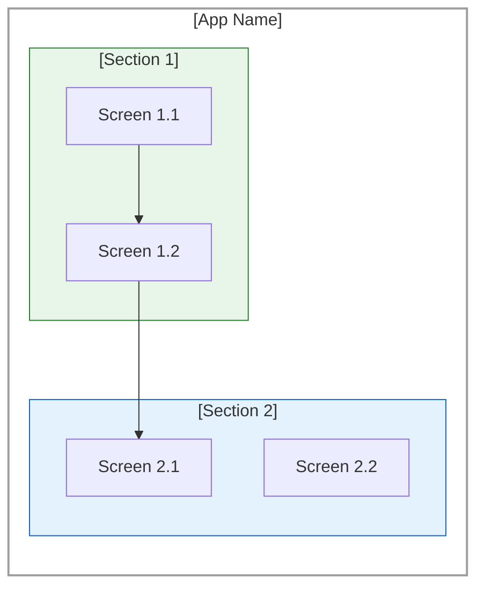
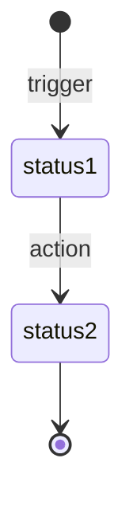

# Information Architecture (IA) Map Workflow

## AI Command

```
/info-map
```

**Prompt:** Analyze the app/feature and generate an Information Architecture (IA) Map. Document the screen structure, navigation hierarchy, routes, and status lifecycles. Output a structured tree diagram, Mermaid flowchart, and route documentation following this template.

---

# [App/Feature Name] - IA Map

**Generated From:** [Source - e.g., Implementation Analysis]
**Date:** [YYYY-MM-DD]
**Purpose:** Document Information Architecture with all current features and flows

---

## Changes from Previous Version (Optional)

| Change Type | Item | Description |
|-------------|------|-------------|
| **REMOVED** | [Item] | [Description] |
| **CHANGED** | [Item] | [Description] |
| **NEW** | [Item] | [Description] |

---

## Key Features Delivered

1. **[Feature 1]** - [Brief description]
2. **[Feature 2]** - [Brief description]
3. **[Feature 3]** - [Brief description]

---

## High-Level Structure

```
[App Name]
│
├── [Section 1]
│   ├── [Screen 1.1]
│   ├── [Screen 1.2]
│   └── [Screen 1.3]
│
├── [Section 2]
│   ├── [Screen 2.1]
│   └── [Screen 2.2]
│
└── [Section 3]
    └── [Screen 3.1]
```

---

## Master IA Diagram



**Legend:**
- Solid arrows (→) indicate primary navigation
- Dashed arrows (-.→) indicate optional/secondary paths

---

## Navigation Paths

| Flow | Primary Path | Optimized For | Alternative |
|------|--------------|---------------|-------------|
| [Flow Name] | [Screen] → [Screen] → [Screen] | [User type] | [Alt path] |

---

## Status Lifecycle (If Applicable)



| Status | Display Label | Description |
|--------|---------------|-------------|
| `status1` | Label | Description |
| `status2` | Label | Description |

---

## Route Structure

### [Section] Routes ([count])

| Route | Screen | Status | Notes |
|-------|--------|--------|-------|
| `/route/path` | ScreenName | Existing | Description |
| `/route/new` | NewScreen | **[NEW]** | Description |

---

## Route Summary

| Category | Count | Notes |
|----------|-------|-------|
| [Category 1] | [X] | [Notes] |
| [Category 2] | [X] | [Notes] |
| **TOTAL** | **[X]** | Active routes |

---

## Screen Inventory

### By Directory

| Directory | Screen Count | Screens |
|-----------|-------------|---------|
| `[dir]/` | [X] | [List of screens] |

---

## How to Use This Template

1. **Identify Sections** - Group screens by feature/domain
2. **Document Structure** - Create tree hierarchy
3. **Create IA Diagram** - Mermaid flowchart showing navigation
4. **Map Routes** - Document all routes with status
5. **Document Lifecycles** - Status transitions for stateful entities
6. **Inventory Screens** - Count and organize by directory
