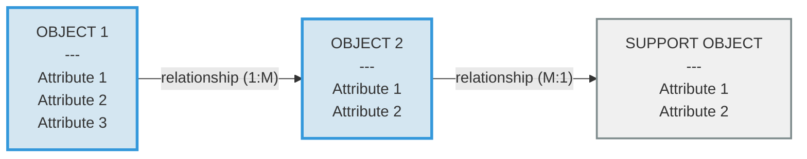
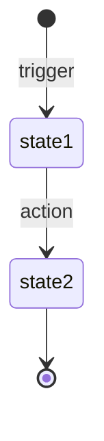

# OOUX Dot Map Workflow

## AI Command

```
/ooux-dot-map
```

**Prompt:** Analyze the app/feature and generate an Entity Relationship diagram using OOUX (Object-Oriented UX) technique. Identify core objects (entities), their attributes, actions, and relationships. Output a Mermaid diagram and structured documentation following this template.

---

# [App/Feature Name] - OOUX Dot Map

**Version:** [X.X]
**Date:** [YYYY-MM-DD]
**Purpose:** Object-Oriented UX analysis of [brief description]

---

## Mermaid Diagram



---

## Object Descriptions

### Core Objects ([count])

| Object | Color | Key Attributes |
|--------|-------|----------------|
| **OBJECT 1** | [Color] | [Key attributes summary] |
| **OBJECT 2** | [Color] | [Key attributes summary] |

---

**OBJECT 1** ([Color])
- [Brief description of what this object represents]
- Attributes: [List all attributes]
- Actions: [List all actions/verbs]

**OBJECT 2** ([Color])
- [Brief description]
- Attributes: [List all attributes]
- Actions: [List all actions/verbs]

---

### Supporting Objects ([count])

| Object | Purpose |
|--------|---------|
| **SUPPORT OBJECT** | [Brief purpose] |

---

**SUPPORT OBJECT** (Gray)
- [Description]
- Attributes: [List]
- Actions: [List]

---

## Relationships

| From | Relationship | To | Cardinality | Description |
|------|-------------|-----|-------------|-------------|
| Object1 | [verb] | Object2 | 1:M | [Description] |
| Object2 | [verb] | Object3 | M:1 | [Description] |

**Cardinality notation:**
- 1:1 - One to one
- 1:M - One to many
- M:1 - Many to one
- M:M - Many to many

---

## User Flows (Optional)

### [Flow Name]

```
User → [action] → [object] → [action] → [result]
  ├─ [condition A] → [path A]
  └─ [condition B] → [path B]
```

**Objects involved:** [List]
**Key behavior:** [Description]

---

## State Lifecycle (Optional)



| Status | Display Label | Description |
|--------|---------------|-------------|
| `state1` | Label | Description |
| `state2` | Label | Description |

---

## How to Use This Template

1. **Identify Core Objects** - The main "things" users interact with (nouns)
2. **List Attributes** - Properties of each object
3. **Define Actions** - What users can do with each object (verbs)
4. **Map Relationships** - How objects connect to each other
5. **Add Supporting Objects** - Secondary objects that support core ones
6. **Document Flows** - Key user journeys through the objects
7. **Define States** - Lifecycle states for stateful objects
