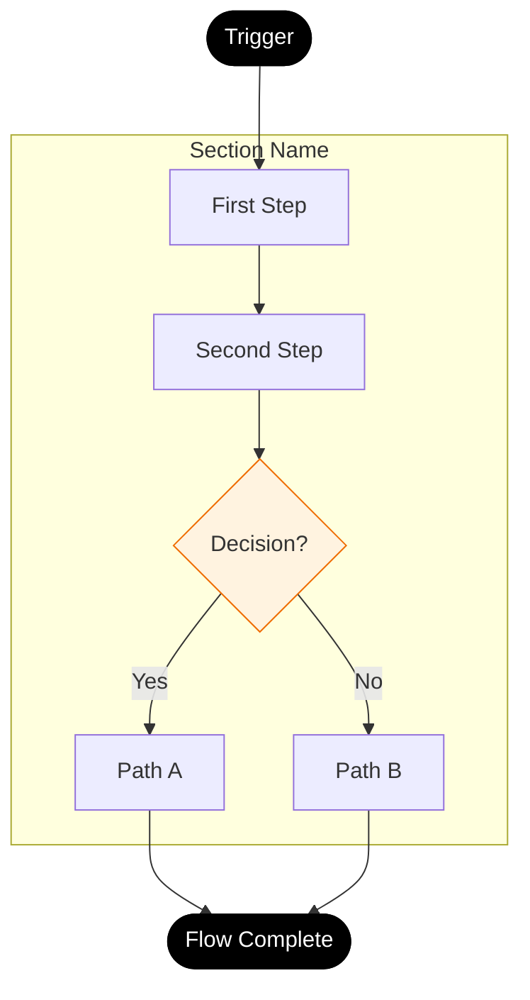
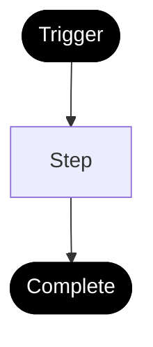

# User Flows Workflow

## AI Command

```
/user-flows
```

**Prompt:** Analyze the app/feature and generate User Flow documentation. Identify jobs-to-be-done, document step-by-step flows with decision points, and create Mermaid flow diagrams following this template.

---

# [App/Feature Name] - User Flows

**Generated From:** [Source - e.g., Implementation Analysis]
**Date:** [YYYY-MM-DD]
**Focus:** [Brief description of main user goals]

---

## Changes from Previous Version (Optional)

| Change Type | Description |
|-------------|-------------|
| **REMOVED** | [Description] |
| **CHANGED** | [Description] |
| **NEW** | [Description] |

---

## Jobs-to-be-Done Summary

| Job ID | Feature | Job Statement | Primary Personas |
|--------|---------|---------------|------------------|
| J1 | [Feature] | When I [situation], I want to [action] so that [outcome] | [Personas] |
| J2 | [Feature] | When I [situation], I want to [action] so that [outcome] | [Personas] |

---

## Flow: [Flow Name] (J[X])

### Flow Steps

| Step | User Action | System Response | Objects Modified | Success Criteria |
|------|-------------|-----------------|------------------|------------------|
| 1 | [Action] | [Response] | [Object: state] | [Criteria] |
| 2 | [Action] | [Response] | [Object: state] | [Criteria] |

### Decision Points

| Branch Point | Condition | Path A | Path B |
|--------------|-----------|--------|--------|
| [Point] | [Condition]? | [Path A] | [Path B] |

### Flow Diagram



---

## Flow: [Another Flow Name] (J[X])

### Flow Steps

| Step | User Action | System Response | Objects Modified | Success Criteria |
|------|-------------|-----------------|------------------|------------------|
| 1 | [Action] | [Response] | [Object: state] | [Criteria] |

### Decision Points

| Branch Point | Condition | Path A | Path B |
|--------------|-----------|--------|--------|
| [Point] | [Condition]? | [Path A] | [Path B] |

### Flow Diagram



---

## Flow Metrics

| Flow | Primary Metric | Target | Fallback Metric |
|------|----------------|--------|-----------------|
| [Flow Name] | [Metric] | [Target %] | [Fallback] |

---

## How to Use This Template

1. **Identify Jobs-to-be-Done** - What users are trying to accomplish
2. **Map Flow Steps** - Sequential actions and responses
3. **Document Decision Points** - Branching logic
4. **Create Flow Diagrams** - Mermaid flowcharts
5. **Define Metrics** - Success criteria for each flow

### Mermaid Styling Guide

| Element | Style | Use For |
|---------|-------|---------|
| START/END | `fill:#000000,color:#ffffff` | Flow boundaries |
| Error states | `fill:#ffebee,stroke:#c62828` | Error handling |
| Warning | `fill:#fff3e0,stroke:#ef6c00` | Warnings/alternatives |
| Info/Processing | `fill:#e3f2fd,stroke:#1565c0` | Background processes |
| Subgraph | Named sections | Group related steps |
